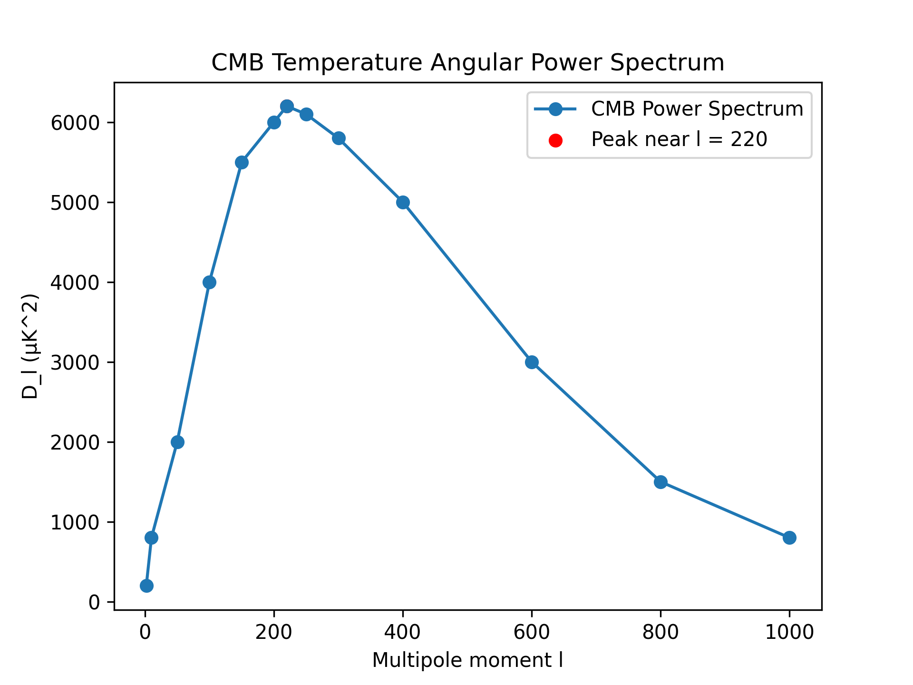

# CMB Angular Power Spectrum Exploration

This project visualizes a simplified CMB temperature angular power spectrum and identifies the first major acoustic peak.

## Method
The script loads CMB power spectrum data, plots D_l as a function of multipole moment l, and locates the maximum value as the first major visible peak.

## Results

### Power Spectrum

## Key Result
First major visible peak near l = 220

## Interpretation
The first acoustic peak is associated with photon-baryon oscillations in the early universe. Low l corresponds to large angular scales, while higher l corresponds to smaller angular scales.

## Notes
This project focuses on interpretation and visualization of the spectrum rather than full cosmological parameter fitting.