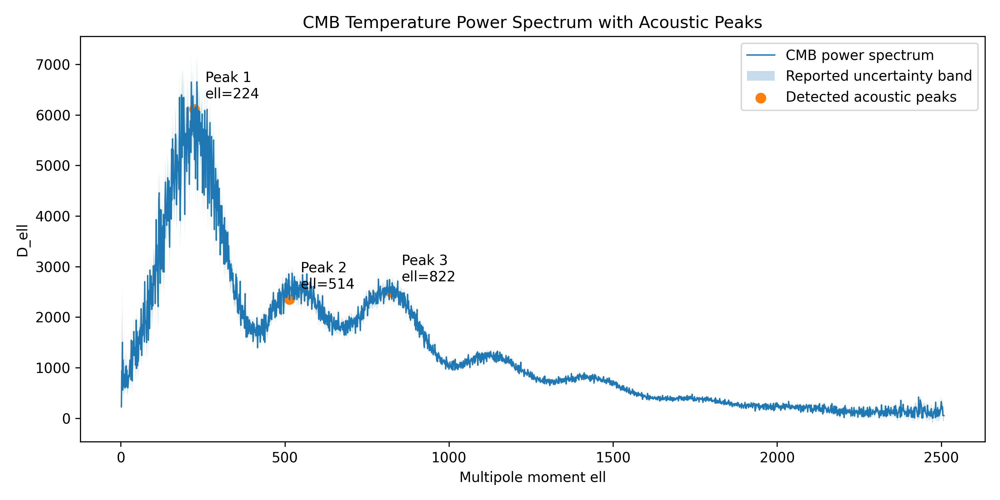
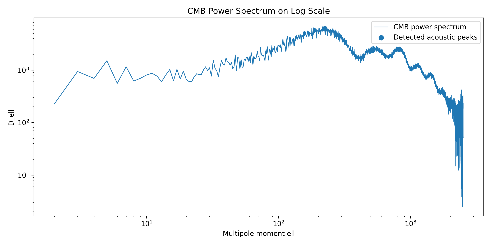
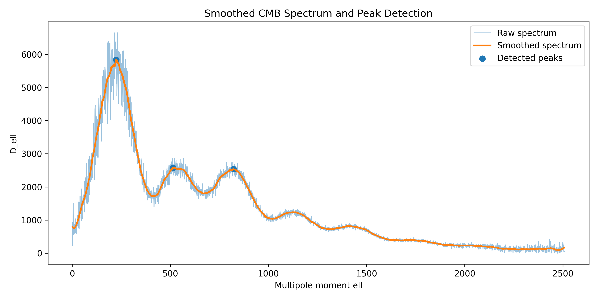

# CMB Power Spectrum Feature Analysis

This project analyzes the cosmic microwave background temperature power spectrum. It identifies acoustic peaks, estimates peak spacing, computes angular scales from multipole locations, and saves the detected spectral features to output tables.

## Project Goal

The goal is to move beyond basic visualization and extract measurable features from the CMB power spectrum. The analysis focuses on the locations of the first acoustic peaks and their connection to angular structure in the early universe.

## Methods

The analysis includes:

- loading CMB power spectrum data
- plotting D_ell against multipole moment ell
- smoothing the spectrum with a Savitzky-Golay filter
- identifying acoustic peaks using prominence and spacing thresholds
- detecting the first three major acoustic peaks
- estimating peak spacing in ell
- converting peak location to angular scale using theta approx 180 / ell
- saving peak and summary tables to CSV

## Repository Structure

    cmb-power-spectrum/
    ├── src/
    │   └── main.py
    ├── data/
    │   └── sample_cmb_power_spectrum.csv
    ├── outputs/
    │   ├── cmb_power_spectrum_peaks.png
    │   ├── cmb_power_spectrum_log.png
    │   ├── cmb_smoothed_peak_detection.png
    │   ├── peak_table.csv
    │   └── spectrum_summary.csv
    ├── docs/
    │   └── interpretation.md
    └── README.md

## Example Outputs

The main spectrum plot marks the detected acoustic peaks.

The log-scale version makes the broad structure of the spectrum easier to inspect across ell.

The smoothed plot shows the spectrum used for peak detection.

## Output Tables

The script saves:

    outputs/peak_table.csv
    outputs/spectrum_summary.csv

The peak table includes:

- peak number
- multipole location ell
- D_ell value
- smoothed D_ell value
- peak prominence
- angular scale in degrees
- spacing from the previous detected peak

## Scientific Context

The first acoustic peak near ell around 220 corresponds to structure on roughly one-degree angular scales. Higher acoustic peaks reflect smaller angular scales and encode information about early-universe plasma oscillations. This project does not fit cosmological parameters, but it extracts observable spectrum features that are used in CMB interpretation.

## Skills Demonstrated

- Python scientific computing
- CMB spectrum analysis
- peak detection
- signal smoothing
- feature extraction
- CSV-based result reporting
- scientific visualization

## Run

Install dependencies:

    python3 -m pip install numpy pandas matplotlib scipy

Run the analysis:

    python3 src/main.py

## Uncertainty-Aware Peak Metrics

The analysis preserves reported spectrum uncertainty columns when they are available in the source data. The main CMB spectrum plot includes an uncertainty band, and the peak table includes uncertainty-aware metrics.

Additional output:

    outputs/cmb_uncertainty_by_ell.png

Additional peak-table columns:

- D_ell_mean_error
- peak_signal_to_uncertainty

These values help distinguish strong acoustic features from lower-confidence fluctuations in the spectrum. This remains a feature-analysis project, not a cosmological parameter fit.
